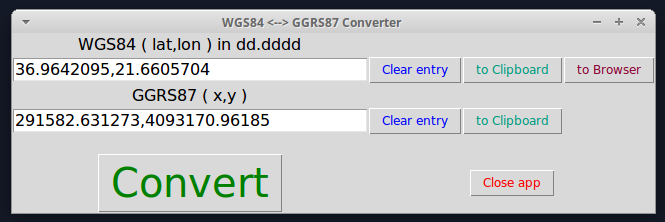

# WGS84 &larr;&rarr; GGRS87 coordinates converter 

## Synopsis

A Python script that converts between the above coordinate systems. Copying to clipboard and opening the WGS84 point in Google maps
with a single click !!

## Type

Python script

## Prerequisites

* Tkinter ```sudo apt-get install python-tk```
* Pyproj ```sudo apt-get install python-pyproj```
* Pyperclip ```sudo apt-get install python-pyperclip```

## Usage
Run the script : ```python WGS84_GGRS87_converter.py```


## Screenshots

